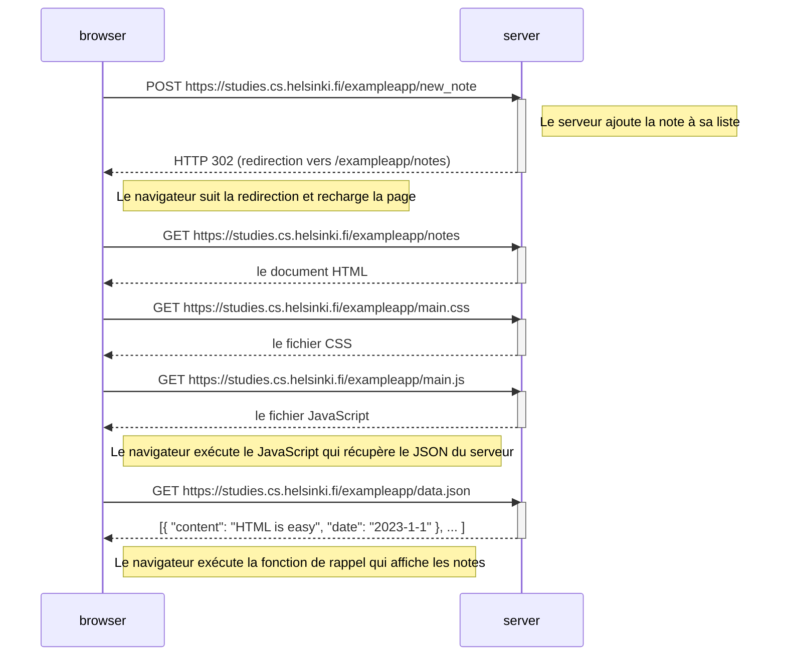

# 0.4 — Nouvelle note (application traditionnelle)

Diagramme de séquence : l'utilisateur écrit une note et clique sur « Save »
dans l'application `notes` (version multi-pages).

```mermaid
sequenceDiagram
    participant browser
    participant server

    browser->>server: POST https://studies.cs.helsinki.fi/exampleapp/new_note
    activate server
    Note right of server: Le serveur ajoute la note à sa liste
    server-->>browser: HTTP 302 (redirection vers /exampleapp/notes)
    deactivate server

    Note right of browser: Le navigateur suit la redirection et recharge la page

    browser->>server: GET https://studies.cs.helsinki.fi/exampleapp/notes
    activate server
    server-->>browser: le document HTML
    deactivate server

    browser->>server: GET https://studies.cs.helsinki.fi/exampleapp/main.css
    activate server
    server-->>browser: le fichier CSS
    deactivate server

    browser->>server: GET https://studies.cs.helsinki.fi/exampleapp/main.js
    activate server
    server-->>browser: le fichier JavaScript
    deactivate server

    Note right of browser: Le navigateur exécute le JavaScript qui récupère le JSON du serveur

    browser->>server: GET https://studies.cs.helsinki.fi/exampleapp/data.json
    activate server
    server-->>browser: [{ "content": "HTML is easy", "date": "2023-1-1" }, ... ]
    deactivate server

    Note right of browser: Le navigateur exécute la fonction de rappel qui affiche les notes
```
