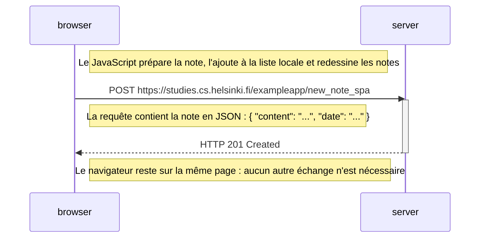

# 0.6 — Nouvelle note dans l'application monopage (SPA)

Diagramme de séquence : l'utilisateur crée une note dans la version SPA.
La page n'est pas rechargée.

```mermaid
sequenceDiagram
    participant browser
    participant server

    Note right of browser: Le JavaScript prépare la note, l'ajoute à la liste locale et redessine les notes

    browser->>server: POST https://studies.cs.helsinki.fi/exampleapp/new_note_spa
    activate server
    Note right of browser: La requête contient la note en JSON : { "content": "...", "date": "..." }
    server-->>browser: HTTP 201 Created
    deactivate server

    Note right of browser: Le navigateur reste sur la même page : aucun autre échange n'est nécessaire
```
